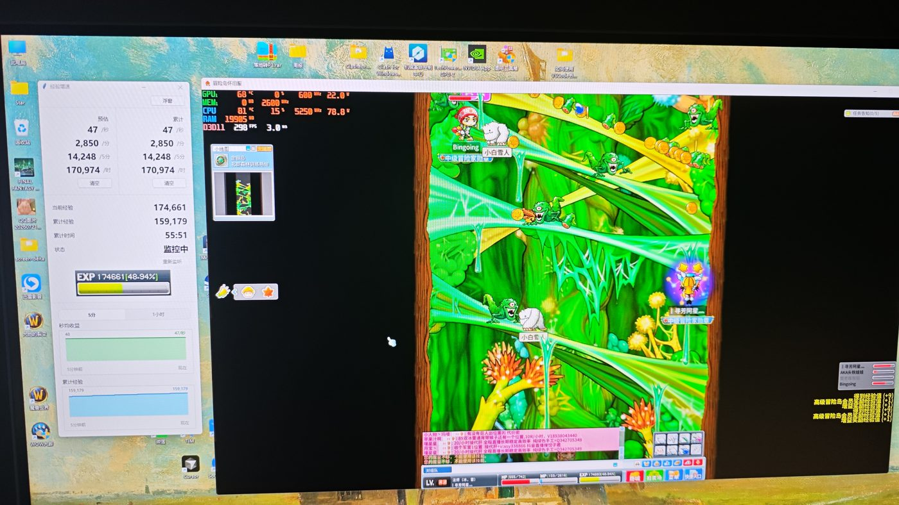

# maplestory_exp_stats
冒险岛经验统计助手，屏幕监控型，不读内存。

## 演示

主窗口：效率 / 累计、监控状态与图表。



## 绿色版

开发机装好依赖后：

```
python scripts/pack.py
```

产物在 `dist/MapleStoryExpStats/`。把整个文件夹拷走，双击 `MapleStoryExpStats.exe` 即可，不需要安装 Python。`data/`（窗口位置、经验历史）写在 exe 旁边。

需要 Windows 10 1803+。体积大约几百 MB（含 OCR 模型）。

## 免责说明

本项目是**非官方**第三方工具，与 Nexon、盛大、完美及任何《冒险岛》运营方无关，未获授权。

它通过屏幕采集（含对游戏窗口的 Windows Graphics Capture）读取经验条像素，再做 OCR。这仍可能被游戏客户端或服务端视为第三方辅助，从而增加**测谎、踢线、封号**等风险。详见 [测谎触发评估](docs/lie-detector-assessment.md)。

使用即表示你自行承担账号与设备上的全部后果。作者不对任何处罚、数据丢失或违规使用负责。请遵守游戏用户协议；本工具不提供、也不应用于外挂、自动战斗或规避反作弊。
